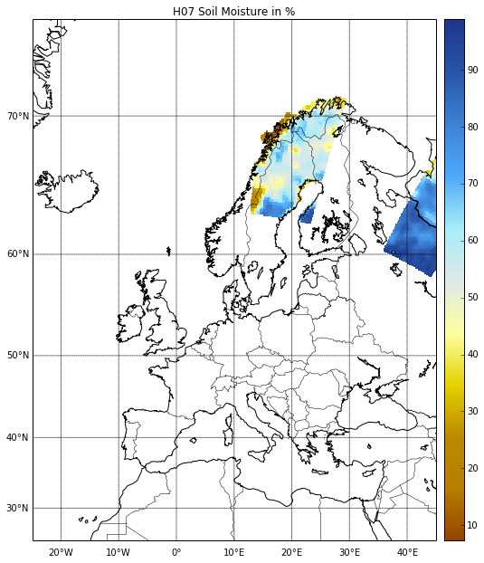
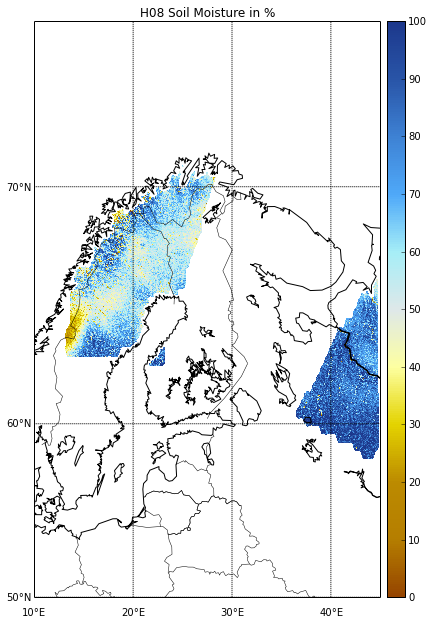
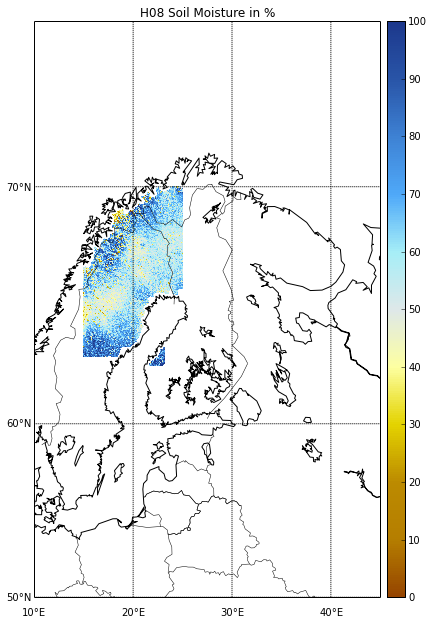
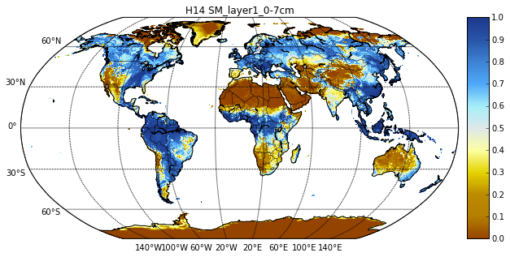
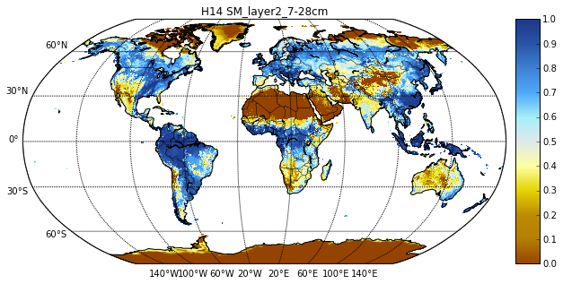
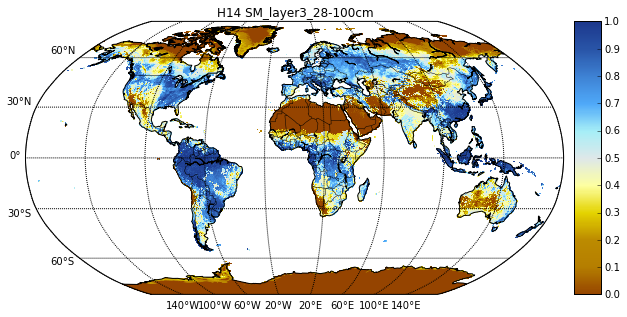
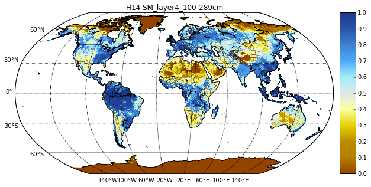

Reading H-SAF images
====================

In this Example we will read and plot images of the H-SAF products H07, H08 and H14.

.. code:: python

    import pytesmo.io.sat.h_saf as h_saf
    import os
    import datetime
    
    #set the paths to the image files
    #I'm using the test images included in the pytesmo package
    
    test_data_path = os.path.join(os.sep+'home','pydev','pytesmo','tests','test_sat','test_data','h_saf')
    h07_path = os.path.join(test_data_path, 'h07')
    h08_path = os.path.join(test_data_path, 'h08')
    h14_path = os.path.join(test_data_path, 'h14')
    
    #initialize the readers with the path
    h07_reader = h_saf.H07img(h07_path)
    h08_reader = h_saf.H08img(h08_path)
    h14_reader = h_saf.H14img(h14_path)

Reading the H07 product
=======================

pytesmo includes one h07 image with the timestamp 2010-05-01 08:33:01
We can either read this image alone if we know the timestamp or iterate over all images on 2010-05-01.

.. code:: python

    #the reader returns not only the data but also metadata and the longitudes and latitudes
    h07_data, metadata, timestamp, lons, lats, time_var = h07_reader.read(datetime.datetime(2010,5,1,8,33,1))
let's inspect the data

.. code:: python

    print type(h07_data)
    # the data is a dictionary, each dictionary key contains the array of one variable
    print "The following variables are in this image", h07_data.keys()

.. parsed-literal::

    <type 'dict'>
    The following variables are in this image ['snow_cover', 'topo_complex', 'ssm', 'jd', 'ssm_noise', 'frozen_prob']

let's inspect surface soil moisture (ssm)

.. code:: python

    print h07_data['ssm'].shape
    # it is only a 1D array to plot the data we also need latitude and logitude information
    print lons.shape
    print lats.shape

.. parsed-literal::

    (1017,)
    (1017,)
    (1017,)

let's resample and plot the ssm data
H07 data is not that easy to plot because it comes in orbit geometry and not on a fixed grid.

.. code:: python

    import matplotlib.pyplot as plt
    from mpl_toolkits.basemap import Basemap
    import pytesmo.colormaps.load_cmap as smcolormaps
    import pytesmo.grid.resample as resample
    import numpy as np
    #lets resample to a 0.1 degree grid
    #define the grid points in latitude and logitude
    lats_dim = np.arange(25,75,0.1)
    lons_dim = np.arange(-25,45,0.1)
    #make 2d grid out the 1D grid spacings
    lons_grid, lats_grid = np.meshgrid(lons_dim,lats_dim)
    
    resampled_data = resample.resample_to_grid(h07_data, lons, lats, 
                                               lons_grid, lats_grid)
    
    fig = plt.figure(figsize=(10,10))
    ax = fig.add_axes([0.1,0.1,0.8,0.8])
    # setup of basemap for europe
    # simple mercator projection
    m = Basemap(llcrnrlon=-25.0,llcrnrlat=25.0,urcrnrlon=45.0,urcrnrlat=75.0,\
                resolution='l',area_thresh=1000.,projection='merc',\
                lat_ts=50.,ax=ax)
    
    # make a pseudocolor plot using the ASCAT SWI colormap
    im = m.pcolormesh(lons_grid, lats_grid, resampled_data['ssm'], latlon=True,
             cmap=smcolormaps.load('SWI_ASCAT'))
    
    m.drawcoastlines()
    m.drawcountries()
    # draw parallels and meridians.
    # label on left and bottom of map.
    parallels = np.arange(20,80,10.)
    m.drawparallels(parallels,labels=[1,0,0,0])
    meridians = np.arange(-60,50,10.)
    m.drawmeridians(meridians,labels=[0,0,0,1])
    # add colorbar
    cb = m.colorbar(im,"right", size="5%", pad='2%')
    ax.set_title('H07 Soil Moisture in %')
    plt.show()

Reading the H08 product
=======================

H08 data has a much higher resolution and comes on a 0.00416 degree grid.

The sample data included in pytesmo was observed on the same time as the included H07 product.

Instead of read you can also use the daily_images iterator.

You just specify a day and it will read all the images that are in your folder for this day. 
 
This also works for the other H07 and H14 reader.

.. code:: python

    #the reader returns not only the data but also metadata and the longitudes and latitudes
    for h08_data, metadata, timestamp, lons, lats, time_var in h08_reader.daily_images(datetime.datetime(2010,5,1)):
        # this tells you the exact timestamp of the read image
        print timestamp.isoformat()
        
        print type(h08_data)
        # the data is a dictionary, each dictionary key contains the array of one variable
        print "The following variables are in this image", h08_data.keys()
        print h08_data['ssm'].shape
        print lons.shape
        print lats.shape

.. parsed-literal::

    2010-05-01T08:33:01
    <type 'dict'>
    The following variables are in this image ['ssm', 'proc_flag', 'ssm_noise', 'corr_flag']
    (3120, 7680)
    (3120, 7680)
    (3120, 7680)

In our case only one image is in the folder so the loop exits after this image is read.

The data has higher resolution but it already comes as a 2D image.

Let's plot it.

.. code:: python

    fig = plt.figure(figsize=(10,10))
    ax = fig.add_axes([0.1,0.1,0.8,0.8])
    # setup of basemap for europe but zoomed in little bit
    # simple mercator projection
    m = Basemap(llcrnrlon=10,llcrnrlat=50.0,urcrnrlon=45.0,urcrnrlat=75.0,\
                resolution='l',area_thresh=1000.,projection='merc',\
                lat_ts=50.,ax=ax)
    
    # make a pseudocolor plot using the ASCAT SWI colormap
    # latitudes and data have to be flipped upside down because the latitudes
    # have to be in ascending order to be plotted correctly
    # mask values > 100 so that they are not plotted
    im = m.pcolormesh(lons, np.flipud(lats), np.ma.masked_greater(np.flipud(h08_data['ssm']),100), latlon=True,
             vmin=0, vmax=100,cmap=smcolormaps.load('SWI_ASCAT'))
    
    m.drawcoastlines()
    m.drawcountries()
    # draw parallels and meridians.
    # label on left and bottom of map.
    parallels = np.arange(20,80,10.)
    m.drawparallels(parallels,labels=[1,0,0,0])
    meridians = np.arange(-60,50,10.)
    m.drawmeridians(meridians,labels=[0,0,0,1])
    # add colorbar
    cb = m.colorbar(im,"right", size="5%", pad='2%')
    ax.set_title('H08 Soil Moisture in %')
    plt.show()

Reading only area of interest
-----------------------------

H08 has a very high resolution, so most people will only want to read it for their area of interest. This can be done using the lat_lon_bbox keyword

.. code:: python

    #the reader returns not only the data but also metadata and the longitudes and latitudes
    h08_roi, metadata, timestamp, lons, lats, time_var = h08_reader.read(datetime.datetime(2010,5,1,8,33,1),
                                                                             lat_lon_bbox=[60,70,15,25])
    
    fig = plt.figure(figsize=(10,10))
    ax = fig.add_axes([0.1,0.1,0.8,0.8])
    # setup of basemap for europe but zoomed in little bit
    # simple mercator projection
    m = Basemap(llcrnrlon=10,llcrnrlat=50.0,urcrnrlon=45.0,urcrnrlat=75.0,\
                resolution='l',area_thresh=1000.,projection='merc',\
                lat_ts=50.,ax=ax)
    
    # make a pseudocolor plot using the ASCAT SWI colormap
    # latitudes and data have to be flipped upside down because the latitudes
    # have to be in ascending order to be plotted correctly
    # mask values > 100 so that they are not plotted
    im = m.pcolormesh(lons, np.flipud(lats), np.ma.masked_greater(np.flipud(h08_roi['ssm']),100), latlon=True,
             vmin=0, vmax=100,cmap=smcolormaps.load('SWI_ASCAT'))
    
    m.drawcoastlines()
    m.drawcountries()
    # draw parallels and meridians.
    # label on left and bottom of map.
    parallels = np.arange(20,80,10.)
    m.drawparallels(parallels,labels=[1,0,0,0])
    meridians = np.arange(-60,50,10.)
    m.drawmeridians(meridians,labels=[0,0,0,1])
    # add colorbar
    cb = m.colorbar(im,"right", size="5%", pad='2%')
    ax.set_title('H08 Soil Moisture in %')
    plt.show()

Reading the H14 product
=======================

The H14 product is a global product on a reduced gaussian grid with a resolution of approx. 25km.

.. code:: python

    #the reader returns not only the data but also metadata and the longitudes and latitudes
    h14_data, metadata, timestamp, lons, lats, time_var = h14_reader.read_img(datetime.datetime(2014, 5, 15))
.. code:: python

    print type(h14_data)
    # the data is a dictionary, each dictionary key contains the array of one variable
    print "The following variables are in this image", h14_data.keys()

.. parsed-literal::

    <type 'dict'>
    The following variables are in this image ['SM_layer1_0-7cm', 'SM_layer2_7-28cm', 'SM_layer3_28-100cm', 'SM_layer4_100-289cm']

.. code:: python

    print h14_data['SM_layer1_0-7cm'].shape
    print lons.shape
    print lats.shape

.. parsed-literal::

    (800, 1600)
    (800, 1600)
    (800, 1600)

The data comes as a 2D array. If the keyword expand_grid is set to False during reader initialization then only 1D arrays would be returned. 

This can be good for working with the data but for plotting the expanded grid is easier to handle.

.. code:: python

    h14_reader_1d = h_saf.H14img(h14_path, expand_grid=False)
    #the reader returns not only the data but also metadata and the longitudes and latitudes
    h14_data_1d, metadata, timestamp, lons_1d, lats_1d, time_var = h14_reader_1d.read_img(datetime.datetime(2014, 5, 15))
    print h14_data_1d['SM_layer1_0-7cm'].shape
    print lons_1d.shape
    print lats_1d.shape

.. parsed-literal::

    (843490,)
    (843490,)
    (843490,)

Let's plot all layers in the H14 image

.. code:: python

    for layer in h14_data:

        fig = plt.figure(figsize=(10,10))
        ax = fig.add_axes([0.1,0.1,0.8,0.8])
        # setup of basemap for the world
        # Robinson projection
        m = Basemap(projection='robin',lon_0=0,resolution='c',ax=ax)
        
        # make a pseudocolor plot using the ASCAT SWI colormap
        # latitudes and data have to be flipped upside down because the latitudes
        # have to be in ascending order to be plotted correctly
        # mask values > 100 so that they are not plotted
        im = m.pcolormesh(lons, lats, h14_data[layer], latlon=True,
                 vmin=0, vmax=1,cmap=smcolormaps.load('SWI_ASCAT'))
        
        m.drawcoastlines()
        m.drawcountries()
        # draw parallels and meridians.
        # label on left and bottom of map.
        parallels = np.arange(-90,90,30.)
        m.drawparallels(parallels,labels=[1,0,0,0])
        meridians = np.arange(-180,180,40.)
        m.drawmeridians(meridians,labels=[0,0,0,1])
        # add colorbar
        cb = m.colorbar(im,"right", size="5%", pad='2%')
        ax.set_title('H14 {:}'.format(layer))
        plt.show()

.. code:: python

    