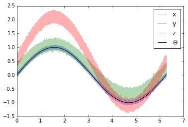
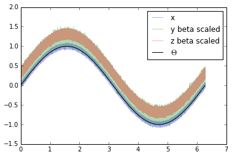
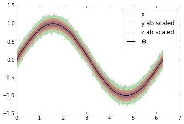

.. _triple-collocation-example:

Triple collocation
==================

Triple collocation can be used to estimate the random error variance in
three collocated datasets of the same geophysical variable [Stoffelen_1998]_. Triple
collocation assumes the following error model for each time series:

:math:`X = \alpha + \beta\Theta + \varepsilon`

in which :math:`\Theta` is the true value of the geophysical variable
e.g. soil moisture. :math:`\alpha` and :math:`\beta` are additive and
multiplicative biases of the data and :math:`\varepsilon` is a zero mean
random noise which we want to estimate.

Estimation of the triple collocation error :math:`\varepsilon` is
commonly done using one of two approaches:

1. Scaling/calibrating the datasets to a reference dataset (removing
   :math:`\alpha` and :math:`\beta`) and calculating the triple
   collocation error based on these datasets.
2. Estimation of the triple collocation error based on the covariances
   between the datasets. This also yields (linear) scaling parameters
   (:math:`\beta`) which can be used if scaling of the datasets is
   desired.

.. note::
    The scaling approaches commonly used in approach 1 are not ideal for e.g. data
    assimilation. Under the assumption that assimilated observations should
    have orthogonal errors, triple collocation based scaling parameters are
    ideal [Yilmaz_2013]_.

    Approach 2 is recommended for scaling if three datasets are available.

Generate a synthetic dataset
----------------------------

We can now make three synthetic time series based on the defined error
model:

:math:`x = \alpha_x + \beta_x\Theta + \varepsilon_x`

:math:`y = \alpha_y + \beta_y\Theta + \varepsilon_y`

:math:`z = \alpha_z + \beta_z\Theta + \varepsilon_z`

In which we will assume that our :math:`\Theta` i.e. the real observed
signal, is a simple sine curve.

.. code:: python

    import numpy as np
    import matplotlib.pyplot as plt
    
    # number of observations
    n = 1000000
    # x coordinates for initializing the sine curve
    coord = np.linspace(0, 2*np.pi, n)
    signal = np.sin(coord)
    
    # error i.e. epsilon of the three synthetic time series
    sig_err_x = 0.02
    sig_err_y = 0.07
    sig_err_z = 0.04
    err_x = np.random.normal(0, sig_err_x, n)
    err_y = np.random.normal(0, sig_err_y, n)
    err_z = np.random.normal(0, sig_err_z, n)
    
    # additive and multiplicative biases
    # they are assumed to be zero for dataset x
    alpha_y = 0.2
    alpha_z = 0.5
    
    beta_y = 0.9
    beta_z = 1.6
    
    x = signal + err_x
    # here we assume errors that are already scaled
    y = alpha_y + beta_y * (signal + err_y) 
    z = alpha_z + beta_z * (signal + err_z)
    
    plt.plot(coord, x, alpha=0.3, label='x')
    plt.plot(coord, y, alpha=0.3, label='y')
    plt.plot(coord, z, alpha=0.3, label='z')
    plt.plot(coord, signal, 'k', label='$\Theta$')
    plt.legend()
    plt.show()

Approach 1
----------

We can now use these three time series and estimate the :math:`\varepsilon`
values using approach 1.

The functions we can be found in:

-  :mod:`pytesmo.scaling`
-  :py:func:`pytesmo.metrics.tcol_error`

We will use mean-standard deviation scaling. This type of scaling brings
the data to the same mean and standard deviation as the reference
dataset.

.. code:: python

    import pytesmo.scaling as scaling
    import pytesmo.metrics as metrics
    
    # scale to x as the reference
    y_scaled = scaling.mean_std(y, x)
    z_scaled = scaling.mean_std(z, x)
    plt.plot(coord, x, alpha=0.3, label='x')
    plt.plot(coord, y_scaled, alpha=0.3, label='y scaled')
    plt.plot(coord, z_scaled, alpha=0.3, label='z scaled')
    plt.plot(coord, signal, 'k', label='$\Theta$')
    plt.legend()
    plt.show()

.. image:: triple_collocation/output_4_0.png

The three datasets do now have the same mean and standard deviation.
This means that :math:`\alpha` and :math:`\beta` have been removed from
:math:`y` and :math:`z`.

From these three scaled datasets we can now estimate the triple
collocation error following the method outlined in [Scipal_2008]_:

The basic formula (formula 4 in the paper) adapted to the notation we
use in this tutorial is:

:math:`\sigma_{\varepsilon_x}^2 = \langle (x-y_{scaled})(x-z_{scaled}) \rangle`

:math:`\sigma_{\varepsilon_y}^2 = \langle (y_{scaled}-x)(y_{scaled}-z_{scaled}) \rangle`

:math:`\sigma_{\varepsilon_z}^2 = \langle (z_{scaled}-x)(z_{scaled}-y_{scaled}) \rangle`

where the :math:`\langle\rangle` brackets mean the temporal mean. This
function is implemented in :py:func:`pytesmo.metrics.tcol_error` which we can
now use to estimate the standard deviation of :math:`\varepsilon`:
:math:`\sigma_{\varepsilon_i}`

.. code:: python

    e_x, e_y, e_z = metrics.tcol_error(x, y_scaled, z_scaled)
    print "Error of x estimated: {:.4f}, true: {:.4f}".format(e_x, sig_err_x)       
    print "Error of y estimated: {:.4f}, true: {:.4f}".format(e_y, sig_err_y)
    print "Error of z estimated: {:.4f}, true: {:.4f}".format(e_z, sig_err_z)

.. parsed-literal::

    Error of x estimated: 0.0200, true: 0.0200
    Error of y estimated: 0.0697, true: 0.0700
    Error of z estimated: 0.0399, true: 0.0400

We can see that the estimated error standard deviation is very close to
the one we set for our artificial time series in the beginning.

Approach 2
----------

In approach 2 we can estimate the triple collocation errors, the scaling
parameter :math:`\beta` and the signal to noise ratio directly from the
covariances of the dataset. For a general overview and how approach 1
and 2 are related please see [Gruber_2015]_.

Estimation of the error variances from the covariances of the datasets
(e.g. :math:`\sigma_{XY}` for the covariance between :math:`x` and
:math:`y`) is done using the following formula:

:math:`\\\sigma_{\varepsilon_x}^2 = \sigma_{X}^2 - \frac{\sigma_{XY}\sigma_{XZ}}{\sigma_{YZ}}\\ \sigma_{\varepsilon_y}^2 = \sigma_{Y}^2 - \frac{\sigma_{YX}\sigma_{YZ}}{\sigma_{XZ}}\\ \sigma_{\varepsilon_z}^2 = \sigma_{Z}^2 - \frac{\sigma_{ZY}\sigma_{ZX}}{\sigma_{YX}}`

:math:`\beta` can also be estimated from the covariances:

:math:`\beta_x = 1 \quad \quad \quad \beta_y = \frac{\sigma_{XZ}}{\sigma_{YZ}} \quad \quad \quad \beta_z=\frac{\sigma_{XY}}{\sigma_{ZY}}`

The signal to noise ratio (SNR) is also calculated from the variances
and covariances:

:math:`\\\text{SNR}_X[dB] = -10\log\left(\frac{\sigma_{X}^2\sigma_{YZ}}{\sigma_{XY}\sigma_{XZ}}-1\right)\\ \text{SNR}_Y[dB] = -10\log\left(\frac{\sigma_{Y}^2\sigma_{XZ}}{\sigma_{YX}\sigma_{YZ}}-1\right)\\ \text{SNR}_Z[dB] = -10\log\left(\frac{\sigma_{Z}^2\sigma_{XY}}{\sigma_{ZX}\sigma_{ZY}}-1\right)`

It is given in dB to make it symmetric around zero. If the value is zero
it means that the signal variance and the noise variance are equal. +3dB
means that the signal variance is twice as high as the noise variance.

This approach is implemented in :py:func:`pytesmo.metrics.tcol_snr`.

.. code:: python

    snr, err, beta = metrics.tcol_snr(x, y, z)
    print "Error of x approach 1: {:.4f}, approach 2: {:.4f}, true: {:.4f}".format(e_x, err[0], sig_err_x)       
    print "Error of y approach 1: {:.4f}, approach 2: {:.4f}, true: {:.4f}".format(e_y, err[1], sig_err_y)
    print "Error of z approach 1: {:.4f}, approach 2: {:.4f}, true: {:.4f}".format(e_z, err[2], sig_err_z)

.. parsed-literal::

    Error of x approach 1: 0.0200, approach 2: 0.0199, true: 0.0200
    Error of y approach 1: 0.0697, approach 2: 0.0700, true: 0.0700
    Error of z approach 1: 0.0399, approach 2: 0.0400, true: 0.0400

It can be seen that both approaches estimate very similar error
variance.

We can now also check if :math:`\beta_y` and :math:`\beta_z` were
correctly estimated.

The function gives us the inverse values of :math:`\beta`. We can use
these values directly to scale our datasets.

.. code:: python

    print "scaling parameter for y estimated: {:.2f}, true:{:.2f}".format(1/beta[1], beta_y)
    print "scaling parameter for z estimated: {:.2f}, true:{:.2f}".format(1/beta[2], beta_z)

.. parsed-literal::

    scaling parameter for y estimated: 0.90, true:0.90
    scaling parameter for z estimated: 1.60, true:1.60

.. code:: python

    y_beta_scaled = y * beta[1]
    z_beta_scaled = z * beta[2]
    plt.plot(coord, x, alpha=0.3, label='x')
    plt.plot(coord, y_beta_scaled, alpha=0.3, label='y beta scaled')
    plt.plot(coord, z_beta_scaled, alpha=0.3, label='z beta scaled')
    plt.plot(coord, signal, 'k', label='$\Theta$')
    plt.legend()
    plt.show()

The datasets still have different mean values i.e. different :math:`\alpha`
values. :math:`\alpha` can be estimated through the mean of the dataset.

.. code:: python

    y_ab_scaled = y_beta_scaled - np.mean(y_beta_scaled)
    z_ab_scaled = z_beta_scaled - np.mean(z_beta_scaled)
    plt.plot(coord, x, alpha=0.3, label='x')
    plt.plot(coord, y_ab_scaled, alpha=0.3, label='y ab scaled')
    plt.plot(coord, z_ab_scaled, alpha=0.3, label='z ab scaled')
    plt.plot(coord, signal, 'k', label='$\Theta$')
    plt.legend()
    plt.show()

This yields scaled/calibrated datasets using triple collocation based
scaling which is ideal for e.g. data assimilation.

The SNR is nothing else than the fraction of the signal variance to the
noise variance in dB

Let's first print the snr we got from :py:func:`pytesmo.metrics.tcol_snr`

.. code:: python

    print snr

.. parsed-literal::

    [ 31.01493632  20.0865377   24.94339476]

Now let's calculate the SNR starting from the variance of the sine
signal and the :math:`\sigma` values we used for our additive errors.

.. code:: python

    [10*np.log10(np.var(signal)/(sig_err_x)**2),
    10*np.log10(np.var(signal)/(sig_err_y)**2),
    10*np.log10(np.var(signal)/(sig_err_z)**2)]

.. parsed-literal::

    [30.969095787133575, 20.087734900128062, 24.94849587385395]

We can see that the estimated SNR and the "real" SNR of our artificial
datasets are very similar.

References
----------

.. [Stoffelen_1998] Stoffelen, A. (1998). Toward the true near-surface wind speed:
   error modeling and calibration using triple collocation. Journal of
   Geophysical Research: Oceans (1978--2012), 103(C4), 7755–7766.

.. [Yilmaz_2013] Yilmaz, M. T., & Crow, W. T. (2013). The optimality of potential
   rescaling approaches in land data assimilation. Journal of
   Hydrometeorology, 14(2), 650–660.

.. [Scipal_2008] Scipal, K., Holmes, T., De Jeu, R., Naeimi, V., & Wagner, W.
       (2008). A possible solution for the problem of estimating the error
       structure of global soil moisture data sets. Geophysical Research
       Letters, 35(24), .

.. [Gruber_2015] Gruber, A., Su, C., Zwieback, S., Crow, W., Dorigo, W., Wagner, W.
       (2015). Recent advances in (soil moisture) triple collocation analysis.
       International Journal of Applied Earth Observation and Geoinformation,
       in press. 10.1016/j.jag.2015.09.002
