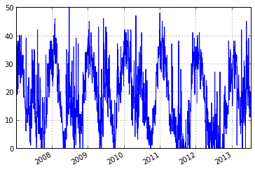
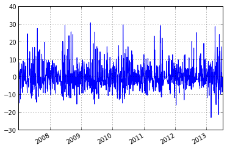
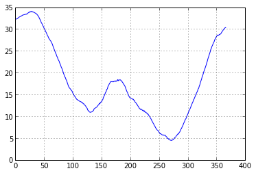
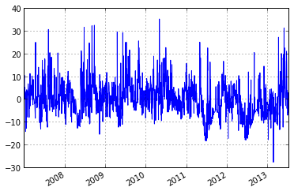

.. code:: python

    import pytesmo.io.sat.ascat as ascat
    import pytesmo.time_series as ts
    
    import os
    import matplotlib.pyplot as plt
.. code:: python

    ascat_folder = os.path.join('R:\\','Datapool_processed','WARP','WARP5.5',
                                             'ASCAT_WARP5.5_R1.2','080_ssm','netcdf')
    ascat_grid_folder = os.path.join('R:\\','Datapool_processed','WARP','ancillary','warp5_grid')
    #init the ASCAT_SSM reader with the paths
    
    ascat_SSM_reader = ascat.AscatH25_SSM(ascat_folder,ascat_grid_folder)
.. code:: python

    ascat_ts = ascat_SSM_reader.read_ssm(45,0)
    #plot soil moisture
    ascat_ts.data['sm'].plot()

.. parsed-literal::

    <matplotlib.axes.AxesSubplot at 0x22ee3550>

.. code:: python

    #calculate anomaly based on moving +- 17 day window
    anomaly = ts.anomaly.calc_anomaly(ascat_ts.data['sm'], window_size=35)
    anomaly.plot()

.. parsed-literal::

    <matplotlib.axes.AxesSubplot at 0x269109e8>

.. code:: python

    #calculate climatology
    climatology = ts.anomaly.calc_climatology(ascat_ts.data['sm'])
    climatology.plot()

.. parsed-literal::

    <matplotlib.axes.AxesSubplot at 0x1bc54ef0>

.. code:: python

    #calculate anomaly based on climatology
    anomaly_clim = ts.anomaly.calc_anomaly(ascat_ts.data['sm'], climatology=climatology)
    anomaly_clim.plot()

.. parsed-literal::

    <matplotlib.axes.AxesSubplot at 0x1bc76860>

.. code:: python

    