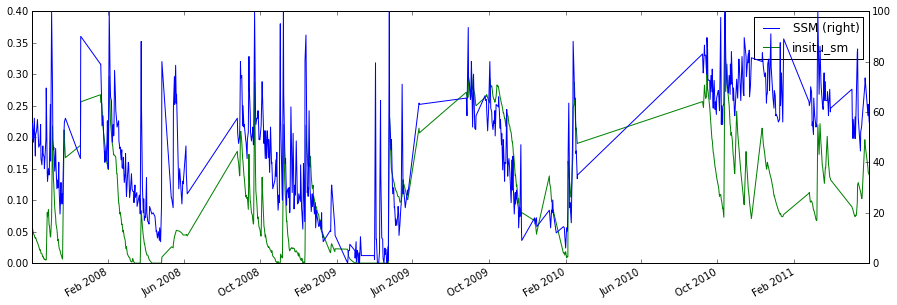
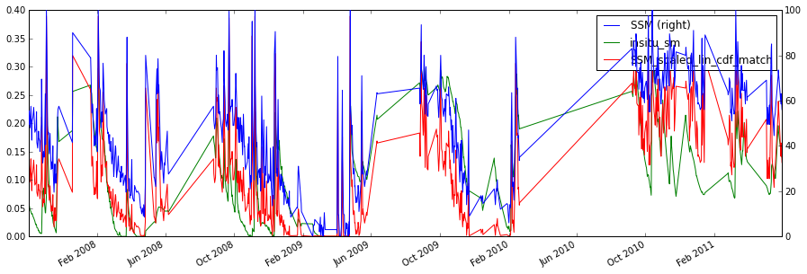
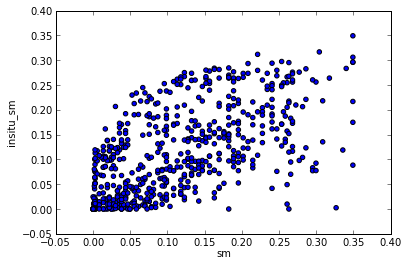
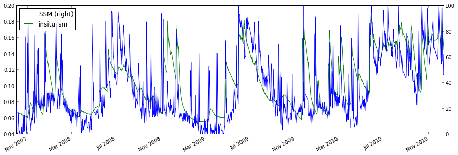
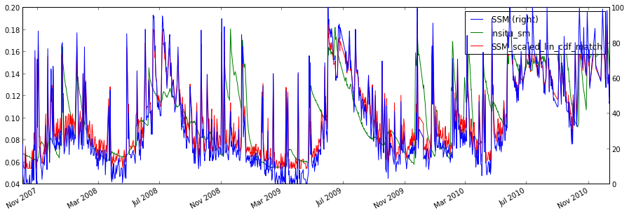
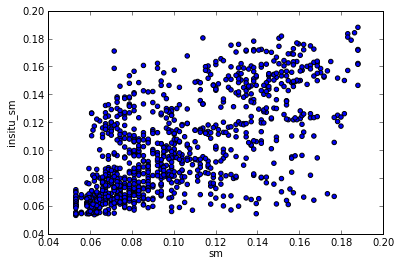

.. code:: python

    import pytesmo.io.ismn.interface as ismn
    import ascat
    import pytesmo.temporal_matching as temp_match
    import pytesmo.scaling as scaling
    import pytesmo.df_metrics as df_metrics
    import pytesmo.metrics as metrics
    
    import os
    import matplotlib.pyplot as plt
.. code:: python

    ascat_folder = os.path.join('R:\\','Datapool_processed','WARP','WARP5.5',
                                             'ASCAT_WARP5.5_R1.2','080_ssm','netcdf')
    ascat_grid_folder = os.path.join('R:\\','Datapool_processed','WARP','ancillary','warp5_grid')
    #init the ASCAT_SSM reader with the paths
    
    #let's not include the orbit direction since it is saved as 'A'
    #or 'D' it can not be plotted
    ascat_SSM_reader = ascat.AscatH25_SSM(ascat_folder,ascat_grid_folder, 
                                          include_in_df=['sm', 'sm_noise', 'ssf', 'proc_flag'])
.. code:: python

    #set path to ISMN data
    path_to_ismn_data =os.path.join('D:\\','small_projects','cpa_2013_07_ISMN_userformat_reader','header_values_parser_test')
    #Initialize reader
    ISMN_reader = ismn.ISMN_Interface(path_to_ismn_data)
.. code:: python

    
.. code:: python

    i = 0
    
    label_ascat='sm'
    label_insitu='insitu_sm'

.. code:: python

    #this loops through all stations that measure soil moisture
    for station in ISMN_reader.stations_that_measure('soil moisture'):
        
        #this loops through all time series of this station that measure soil moisture
        #between 0 and 0.1 meters
        for ISMN_time_series in station.data_for_variable('soil moisture',min_depth=0,max_depth=0.1):
            
            ascat_time_series = ascat_SSM_reader.read_ssm(ISMN_time_series.longitude,
                                                          ISMN_time_series.latitude,
                                                          mask_ssf=True,
                                                          mask_frozen_prob = 5,
                                                          mask_snow_prob = 5)
            
    
            #drop nan values before doing any matching
            ascat_time_series.data = ascat_time_series.data.dropna()
            
            ISMN_time_series.data = ISMN_time_series.data.dropna()
            
            #rename the soil moisture column in ISMN_time_series.data to insitu_sm
            #to clearly differentiate the time series when they are plotted together
            ISMN_time_series.data.rename(columns={'soil moisture':label_insitu},inplace=True)
            
            #get ISMN data that was observerd within +- 1 hour(1/24. day) of the ASCAT observation
            #do not include those indexes where no observation was found
            matched_data = temp_match.matching(ascat_time_series.data,ISMN_time_series.data,
                                                    window=1/24.)
            #matched ISMN data is now a dataframe with the same datetime index
            #as ascat_time_series.data and the nearest insitu observation      
            
            #continue only with relevant columns
            matched_data = matched_data[[label_ascat,label_insitu]]
            
            #the plot shows that ISMN and ASCAT are observed in different units
            matched_data.plot(figsize=(15,5),secondary_y=[label_ascat],
                              title='temporally merged data')
            plt.show()
            
            #this takes the matched_data DataFrame and scales all columns to the 
            #column with the given reference_index, in this case in situ 
            scaled_data = scaling.scale(matched_data, method='lin_cdf_match',
                                             reference_index=1)
            
            #now the scaled ascat data and insitu_sm are in the same space    
            scaled_data.plot(figsize=(15,5), title='scaled data')
            plt.show()
            
            plt.scatter(scaled_data[label_ascat].values,scaled_data[label_insitu].values)
            plt.xlabel(label_ascat)
            plt.ylabel(label_insitu)
            plt.show()
            
            #calculate correlation coefficients, RMSD, bias, Nash Sutcliffe
            x, y = scaled_data[label_ascat].values, scaled_data[label_insitu].values
            
            print "ISMN time series:",ISMN_time_series
            print "compared to"
            print ascat_time_series
            print "Results:"
            
            #df_metrics takes a DataFrame as input and automatically
            #calculates the metric on all combinations of columns
            #returns a named tuple for easy printing
            print df_metrics.pearsonr(scaled_data)
            print "Spearman's (rho,p_value)", metrics.spearmanr(x, y)
            print "Kendalls's (tau,p_value)", metrics.kendalltau(x, y)
            print df_metrics.kendalltau(scaled_data)
            print df_metrics.rmsd(scaled_data)
            print "Bias", metrics.bias(x, y)
            print "Nash Sutcliffe", metrics.nash_sutcliffe(x, y)
            
            
        i += 1
        
        #only show the first 2 stations, otherwise this program would run a long time
        #and produce a lot of plots
        if i >= 2:
            break    

.. parsed-literal::

    ISMN time series: OZNET Alabama 0.00 m - 0.05 m soil moisture measured with Stevens-Hydra-Probe 
    compared to
    ASCAT time series gpi:1884359 lat:-35.342 lon:147.541
    Results:
    (Pearsons_r(sm_and_insitu_sm=0.61607679781575175), p_value(sm_and_insitu_sm=3.1170801211098453e-65))
    Spearman's (rho,p_value) (0.64651747115098912, 1.0057610194056589e-73)
    Kendalls's (tau,p_value) (0.4685441550995097, 2.4676437876515864e-67)
    (Kendall_tau(sm_and_insitu_sm=0.4685441550995097), p_value(sm_and_insitu_sm=2.4676437876515864e-67))
    rmsd(sm_and_insitu_sm=0.078018684719599857)
    Bias 0.00168114697282
    Nash Sutcliffe 0.246416864767

.. parsed-literal::

    ISMN time series: OZNET Balranald-Bolton_Park 0.00 m - 0.08 m soil moisture measured with CS615 
    compared to
    ASCAT time series gpi:1821003 lat:-33.990 lon:146.381
    Results:
    (Pearsons_r(sm_and_insitu_sm=0.66000287576696759), p_value(sm_and_insitu_sm=1.3332742454781072e-126))
    Spearman's (rho,p_value) (0.65889275747696652, 4.890533231776912e-126)
    Kendalls's (tau,p_value) (0.48653686844813893, 6.6517671082477896e-118)
    (Kendall_tau(sm_and_insitu_sm=0.48653686844813893), p_value(sm_and_insitu_sm=6.6517671082477896e-118))
    rmsd(sm_and_insitu_sm=0.028314835540753237)
    Bias 4.56170862568e-05
    Nash Sutcliffe 0.316925662899

.. code:: python

    
