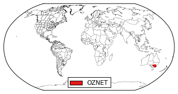
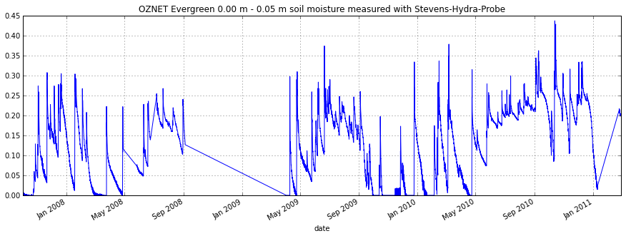

In[1]::

    import pytesmo.io.ismn.interface as ismn
    import os
    import matplotlib.pyplot as plt
    import random

In[2]::

    #path unzipped file downloaded from the ISMN web portal
    #on windows the first string has to be your drive letter
    #like 'C:\\'
    path_to_ismn_data = os.path.join('D:\\','small_projects','cpa_2013_07_ISMN_userformat_reader',
                                          'header_values_parser_test')
In[3]::

    #initialize interface, this can take up to a few minutes the first
    #time, since all metadata has to be collected
    ISMN_reader = ismn.ISMN_Interface(path_to_ismn_data)

    #plot available station on a map
    fig, ax = ISMN_reader.plot_station_locations()
    plt.show()

In[4]::

    #select random network and station to plot
    networks = ISMN_reader.list_networks()
    print "Available Networks:"
    print networks

.. parsed-literal::

    Available Networks:
    ['OZNET']

In[5]::

    network = random.choice(networks)
    stations = ISMN_reader.list_stations(network = network)
    print "Available Stations in Network %s"%network
    print stations

.. parsed-literal::

    Available Stations in Network OZNET
    ['Alabama' 'Balranald-Bolton_Park' 'Banandra' 'Benwerrin' 'Bundure'
     'Canberra_Airport' 'Cheverelis' 'Cooma_Airfield' 'Cootamundra_Aerodrome'
     'Cox' 'Crawford' 'Dry_Lake' 'Eulo' 'Evergreen' 'Ginninderra_K4'
     'Ginninderra_K5' 'Griffith_Aerodrome' 'Hay_AWS' 'Keenan' 'Kyeamba_Downs'
     'Kyeamba_Mouth' 'Kyeamba_Station' 'Rochedale' 'S_Coleambally' 'Samarra'
     'Silver_Springs' 'Spring_Bank' 'Strathvale' 'Uri_Park' 'Waitara'
     'Weeroona' 'West_Wyalong_Airfield' 'Widgiewa' 'Wollumbi' 'Wynella'
     'Yamma_Road' 'Yammacoona' 'Yanco_Research_Station']

In[6]::

    station = random.choice(stations)
    station_obj = ISMN_reader.get_station(station)
    print "Available Variables at Station %s"%station
    #get the variables that this station measures
    variables = station_obj.get_variables()
    print variables

.. parsed-literal::

    Available Variables at Station Evergreen
    ['precipitation' 'soil moisture' 'soil temperature']

In[7]::

    #to make sure the selected variable is not measured
    #by different sensors at the same depths
    #we also select the first depth and the first sensor
    #even if there is only one
    depths_from,depths_to = station_obj.get_depths(variables[0])

    sensors = station_obj.get_sensors(variables[0],depths_from[0],depths_to[0])

    #read the data of the variable, depth, sensor combination
    time_series = station_obj.read_variable(variables[0],depth_from=depths_from[0],depth_to=depths_to[0],sensor=sensors[0])

    #print information about the selected time series
    print "Selected time series is:"
    print time_series

.. parsed-literal::

    Selected time series is:
    OZNET Evergreen -0.50 m - -0.50 m precipitation measured with TB4-0.2-mm-tipping-bucket-raingauge

In[8]::

    #plot the data
    time_series.plot()
    #with pandas 0.12 time_series.plot() also works
    plt.legend()
    plt.show()

.. image:: plot_ISMN_files/plot_ISMN_7_0.png

In[9]::

    #we also want to see soil moisture
    sm_depht_from,sm_depht_to = station_obj.get_depths('soil moisture')
    print sm_depht_from,sm_depht_to

.. parsed-literal::

    [ 0.   0.   0.3  0.6] [ 0.05  0.3   0.6   0.9 ]

In[10]::

    #read sm data measured in first layer 0-0.05m
    sm = station_obj.read_variable('soil moisture',depth_from=0,depth_to=0.05)
    sm.plot()
    plt.show()

