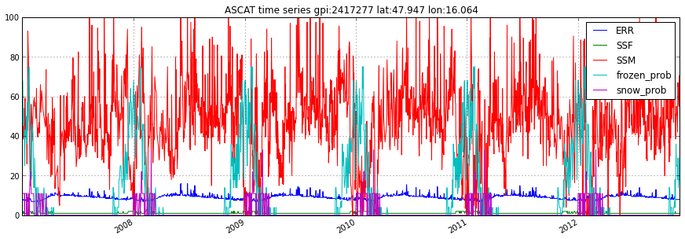
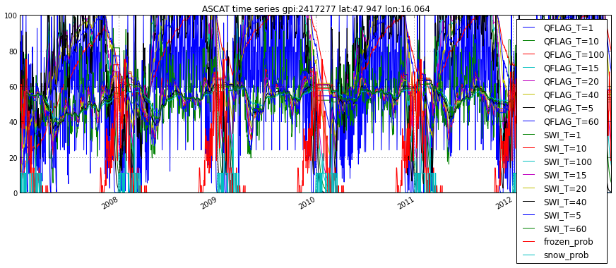
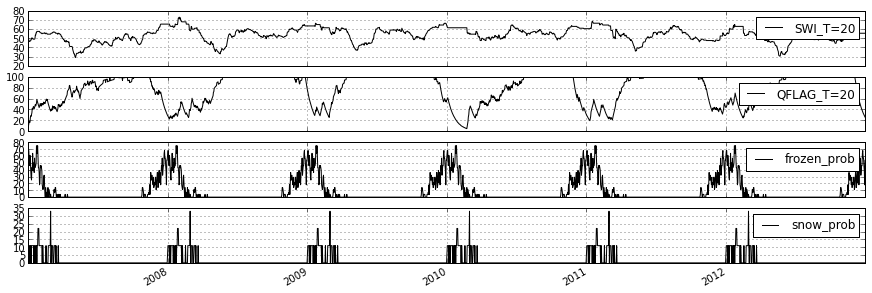
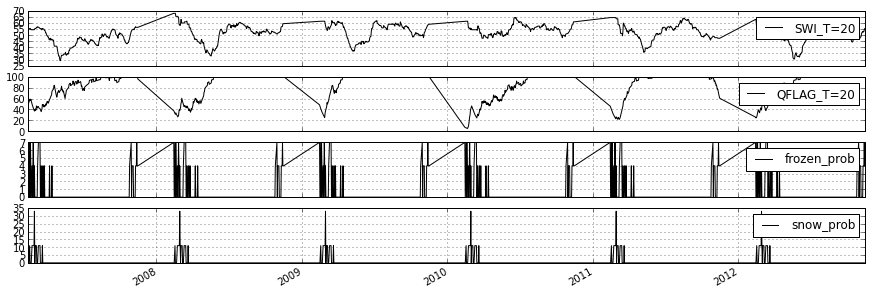

In[1]::

   import pytesmo.io.sat.ascat as ascat
   import os
   import matplotlib.pyplot as plt
   
--------------
    
In[2]::

    #I've downloaded my ASCAT data to a folder on my D drive
    path_to_ascat_ssm_data = os.path.join('D:\\','small_projects','cpa_2013_07_userformat_reader',
                                          'data','ASCAT_SSM_25km_ts_WARP5.5_R0.1','data')
    path_to_ascat_swi_data = os.path.join('D:\\','small_projects','cpa_2013_07_userformat_reader',
                                          'data','ASCAT_SWI_25km_ts_WARP5.5_R0.1','data')
    #path to grid definition file, default name TUW_W54_01_lonlat-ld-land.txt
    path_to_grid_definition = os.path.join('D:\\','small_projects','cpa_2013_07_userformat_reader',
                                          'data','auxiliary_data','grid_info')
    #path to advisory flags from FTP Server
    path_to_adv_flags = os.path.join('D:\\','small_projects','cpa_2013_07_userformat_reader',
                                          'data','auxiliary_data','advisory_flags')
                                          
--------------                            
                                       
In[3]::

    #init the ASCAT_SSM reader with the paths
    ascat_SSM_reader = ascat.Ascat_SSM(path_to_ascat_ssm_data,path_to_grid_definition,
                                       advisory_flags_path = path_to_adv_flags)
In[4]::

    lon, lat = 16, 48
    
    #reads ssm data nearest to this lon,lat coordinates
    ssm_data_raw = ascat_SSM_reader.read_ssm(lon,lat)
    
    #plot the data using pandas builtin plot functionality
    ssm_data_raw.plot()
    plt.show()

In[5]::

    #read the same data but mask observations where the SSF shows frozen
    #and where frozen and snow probabilty are greater than 20%
    ssm_data_masked = ascat_SSM_reader.read_ssm(lon,lat,mask_ssf=True,mask_frozen_prob=20,mask_snow_prob=20)
    
    #plot the data using pandas builtin plot functionality
    #this time using a subplot for each variable in the DataFrame
    ssm_data_masked.plot(subplots=True)
    plt.show()

.. image:: plot_ascat_data_files/plot_ascat_data_4_0.png

In[6]::

    #plot raw and masked SSM data in one plot to compare them
    
    ssm_data_raw.data['SSM'].plot(label='raw SSM data')
    ssm_data_masked.data['SSM'].plot(label='masked SSM data')
    plt.legend()
    plt.show()

.. image:: plot_ascat_data_files/plot_ascat_data_5_0.png

In[7]::

    ascat_SWI_reader = ascat.Ascat_SWI(path_to_ascat_swi_data,path_to_grid_definition,
                                       advisory_flags_path = path_to_adv_flags)
    
    
    #reads swi data nearest to this lon,lat coordinates
    #without any additional keywords all unmasked T values and
    #Quality flags will be read
    swi_data_raw = ascat_SWI_reader.read_swi(lon,lat)
    
    #plot the data using pandas builtin plot functionality
    swi_data_raw.plot()
    plt.show()

In[8]::

    #read the same data but this time only SWI with a T value
    #of 20 is returned
    swi_data_T_20 = ascat_SWI_reader.read_swi(lon,lat,T=20)
    
    #plot the data using pandas builtin plot functionality
    #this time using a subplot for each variable in the DataFrame
    swi_data_T_20.plot(subplots=True)
    plt.show()

In[9]::

    #you can also mask manually if you prefer
    swi_data_T_20.data = swi_data_T_20.data[swi_data_T_20.data['frozen_prob'] < 10]
    
    swi_data_T_20.plot(subplots=True)
    plt.show()
    

    
