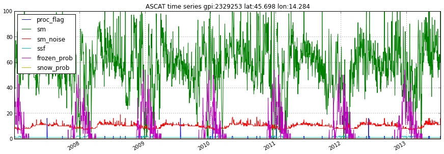
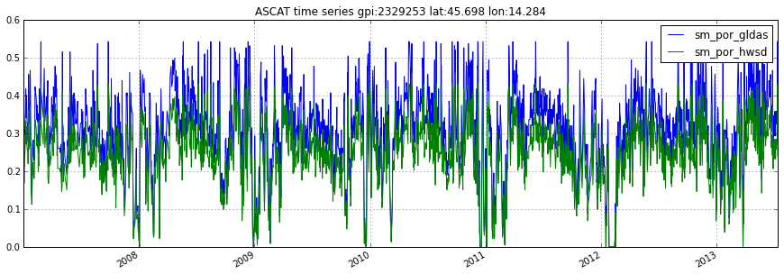
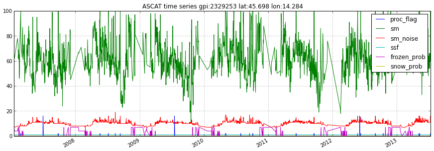

In[1]::

    import matplotlib.pyplot as plt
    import pytesmo.io.sat.ascat as ascat
    import os
    ascat_folder = os.path.join('R:\\','Datapool_processed','WARP','WARP5.5',
                                             'ASCAT_WARP5.5_R1.2','080_ssm','netcdf')
    ascat_grid_folder = os.path.join('R:\\','Datapool_processed','WARP','ancillary','warp5_grid')
    #init the ASCAT_SSM reader with the paths
    #ascat_folder is the path in which the cell files are located e.g. TUW_METOP_ASCAT_WARP55R12_0600.nc
    #ascat_grid_folder is the path in which the file TUW_WARP5_grid_info_2_1.nc is located
    
    #let's not include the orbit direction since it is saved as 'A'
    #or 'D' it can not be plotted
    
    # the AscatH25_SSM class automatically detects the version of data that you have in your
    # ascat_folder. Please do not mix files of different versions in one folder
    ascat_SSM_reader = ascat.AscatH25_SSM(ascat_folder,ascat_grid_folder, 
                                          include_in_df=['sm', 'sm_noise', 'ssf', 'proc_flag'])
    
    gpi = 2329253
    ascat_ts = ascat_SSM_reader.read_ssm(gpi)
    
    ascat_ts.plot()
    plt.show()

In[2]::

    #the ASCATTimeSeries object also contains metadata
    
    print "Topographic complexity", ascat_ts.topo_complex
    print "Wetland fraction", ascat_ts.wetland_frac
    print "Porosity from GLDAS model", ascat_ts.porosity_gldas
    print "Porosity from Harmonized World Soil Database", ascat_ts.porosity_hwsd
    

.. parsed-literal::

    Topographic complexity 14
    Wetland fraction 0
    Porosity from GLDAS model 0.542222
    Porosity from Harmonized World Soil Database 0.430234
    
In[3]::

    #It is also possible to automatically convert the soil moisture to absolute values using
    
    ascat_ts_absolute = ascat_SSM_reader.read_ssm(gpi, absolute_values=True)
    #this introduces 4 new columns in the returned data
    #scaled sm and sm_noise with porosity_gldas
    #scaled sm and sm_noise with porosity_hwsd
    print ascat_ts_absolute.data
    
    #select relevant columns and plot
    ascat_ts_absolute.data = ascat_ts_absolute.data[['sm_por_gldas','sm_por_hwsd']]
    ascat_ts_absolute.plot()
    plt.show()
    
    

.. parsed-literal::

    <class 'pandas.core.frame.DataFrame'>
    DatetimeIndex: 2292 entries, 2007-01-01 09:39:39 to 2013-07-12 20:39:08
    Data columns (total 10 columns):
    proc_flag             2292  non-null values
    sm                    2285  non-null values
    sm_noise              2285  non-null values
    ssf                   2292  non-null values
    sm_por_gldas          2285  non-null values
    sm_noise_por_gldas    2285  non-null values
    sm_por_hwsd           2285  non-null values
    sm_noise_por_hwsd     2285  non-null values
    frozen_prob           2285  non-null values
    snow_prob             2285  non-null values
    dtypes: float64(8), int16(1), int8(1)
    

In[4]::

    #We can also automatically mask the data during reading
    #In this example all measurements where the Surface State Flag
    #shows frozen or where the frozen or snow probabilities are more
    #than 10 percent are removed from the time series
    ascat_ts = ascat_SSM_reader.read_ssm(gpi, mask_ssf=True, 
                                         mask_frozen_prob=10,
                                         mask_snow_pro=10)
    
    ascat_ts.plot()
    plt.show()

    
